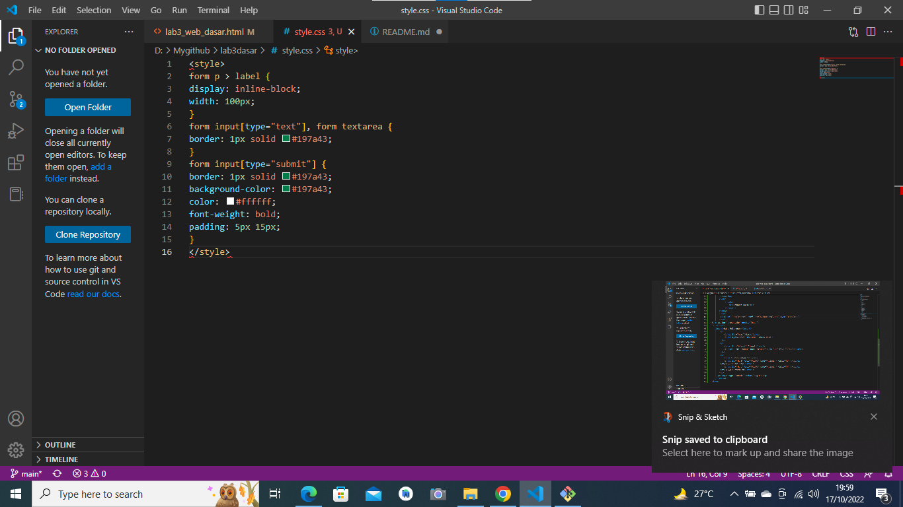
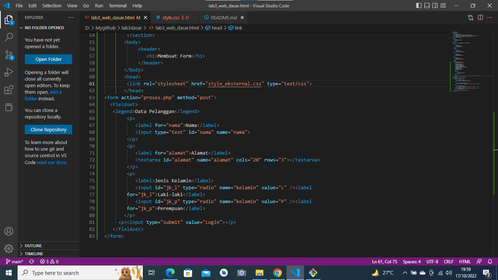
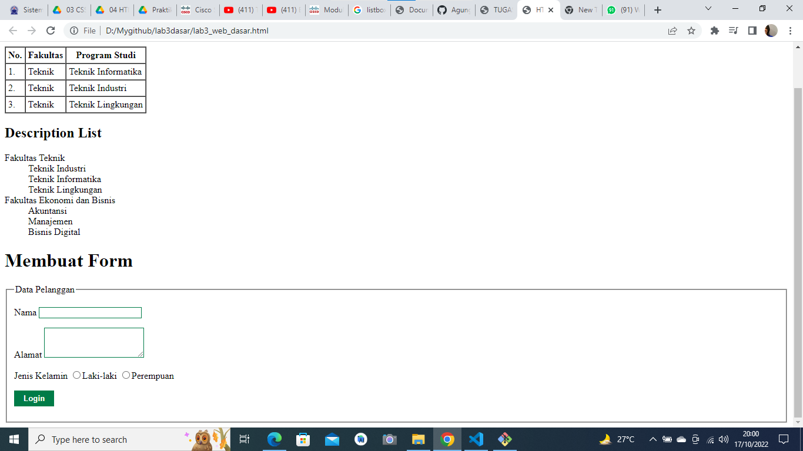

# lab3dasar
Hi ini lab 3 dasar
lestgo
membuat dropdown dengan baris dan kolom ini tampilan code dan hasil nya

2. membuat list padaa html

3. membuat dropdown dan listbox pada bentuk form 
ini tampilan nya dan code nya

